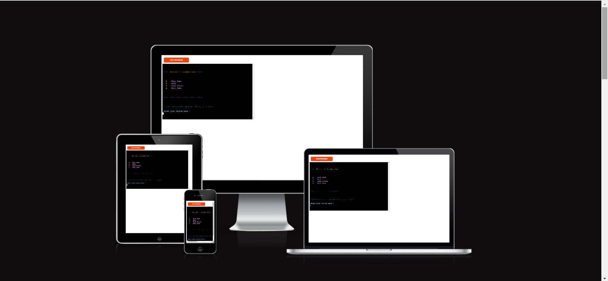
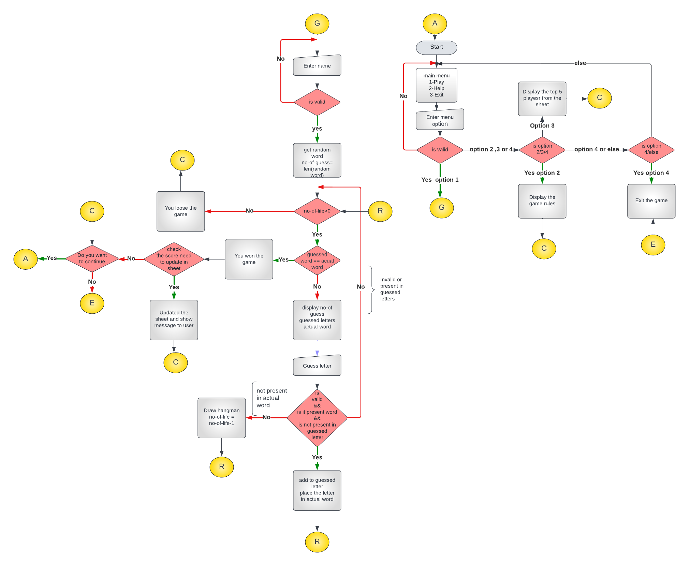

## HANGMAN Game

Hangman is an old school favorite, a word game where the goal is simply to find the missing word.You will be presented with a number of blank spaces representing the missing letters you need to find.Use the keyboard to guess a letter. Guessing a new letter each go, if you choose correct, the terminal will tell you and show you where it belongs in the randomly chosen word, if your guess is wrong, then start to draw "hangman" until it is complete.

The actual words are chosen randomly from many words. The game gives number of guess equal to the length of the word. 

## How to play
   1. Please enter valid options like 1,2,3 and 4 to play the game
   2. Enter valid name i.e name contains only alphabet and minumum 2 letter
   3. Guess only single alphabet letter and number of guess is eaual to the length of  the actual word
   4. If guessed letter is not found in the actual word then you loose one number of  guess and display the hangman based on the number of life remaining
   5. If guessed letter is already gussed previously then try to guess another letter and you wont loose the number of guess
   6. If number of guess is zeor and guessed letter and actual word are not same then you loose the game
   7. If guessed and actual word are same then you won the game
   8. After won the game, will check the number of life used is best in the sheet then update the sheet
      with player name and new score in appropriate position.   

## Business goals of the website 
This website is developed as part of the third project in diploma in Software Development from The Code Institute and this project mainly focued on the python logic and familier with python language.

A live version of this website will be found here: https://hangman-gameapp.herokuapp.com/

## Table of Contents ##

- [HANGMAN Game](#hangman-game)
- [How to play](#how-to-play)
- [Business goals of the website](#business-goals-of-the-website)
- [Table of Contents](#table-of-contents)
- [UX](#ux)
  - [Strategy](#strategy)
  - [User Demographic](#user-demographic)
  - [User Stories](#user-stories)
    - [Existing Members](#existing-members)
    - [New Users](#new-users)
  - [User Goals](#user-goals)
  - [Scope](#scope)
  - [Design](#design)
  - [Flowchart](#flowchart)
- [Features](#features)
  - [Existing Features](#existing-features)
  - [Future Features](#future-features)
- [Technologies used](#technologies-used)
  - [Python libraries and API](#python-libraries-and-api)
- [UX Stories Testing](#ux-stories-testing)
  - [Bugs](#bugs)
  - [Validator Testing](#validator-testing)
- [Development and Deployment](#development-and-deployment)
  - [Using Heroku](#using-heroku)
- [Content](#content)
- [Credits](#credits)
  - [For code inspiration, design inputs, help and advice. Many thanks to:](#for-code-inspiration-design-inputs-help-and-advice-many-thanks-to)
  - [Great sources](#great-sources)
------------------------------------------------------------------------------------------------------------

## UX

### Strategy

This Game is ment for:

 - Fun activity 
 - Guess word puzzle
 - Help to improve vocabulary 
 - As the rules are easy, kids can enjoy
 - Any age person can enjoy the game 

What user looking for?
 - Easy to understand the game rules
 - Easy to play using the button and instructions
 - Numbe of guess left and user guessed letters should be visible
 - User shoud know if any thing goes wrong by showing clear message
 - Once the game is over it should show user won or lost
 - Player want to go for next level
 - Player wanr option to enter their name on the score board

Based on all the above requirements, built the game in such a way that 
  - Option Help give the detail instructions which make game easy to play
  - Clear message tells the user what to do next during the game 
  - Guessed word, number of guess left, previously guessed letters visible always to the user 
  - Display the message that player won or loose game
  
### User Demographic

 This application has been designed for users of all ages just for some fun, to test their knowledge and this game help to improve vocabulary

### User Stories

#### Existing Members

 - As a Member: I want to play the game easily
 - As a Member: Need to select mode of game like easy, medium and hard
 - As a Member: I wan to see player won or loose the game
 - As a member: Need to save number of guess took to predict the word

#### New Users

 - As a new User: I want to know how to play the game.
 - As a new User: I want to the look and feel of the game and instructions should be simple.
 - As a new User: I want to see and share the last 10 highest scores using social medias .

### User Goals

 - Easy to use the game by using keyboard with the help of instructions
 - Rules should be clear and concise information to the player 
 - Number of guess left, predicted word and previously gussed letters should be visible to   the player

### Scope

HangMan is a game which guess the letters in the secret word to solve the puzzle aims to familarize with python language and inbuilt libraries.The objective is to build a fun, interactive game for individuals of all ages.

Users may play a fun and exciting game of HungMan against the computer and after each guess, plyaer will clearly know the number guess left to finish the game.

### Design

HangMan project's design has been influenced by the ”Portfolio Project 3 Scope” and "Love sandwitches" - projects.
My design of the project's functionality, coding styles and comments influenced by my previous project "Rock Paper Scisssors".

Main aim is to create a interactive clean and simple interactive terminal where there is a user to get clear info regarding the game in each step.

HangMan is a simple game which has three pages rule.py module exlain how to play the game words.py moduke has list of words and run.py module contain the core functionality of the game. Computer pick the word randomly from words.py and ask the user to guess a letter.Game give three options like play Game, Help and Exit Game. 

### Flowchart

[Back to top](#hangman-game)

## Features 

HangMan is a single page game that consists of these sections:

 - Landing page with main menu
 - Play Game 
 - Help
 - High Scores
 - Exit Game   
 - Game info contains no of guess left, previously guessed letters and predict word
 - Message

### Existing Features

 Landing page 

 The user is firstly presented with a menu page, showing the options for the game. 
  1 -> Play Game
  2 -> Help
  3 -> High Scores
  4 -> Exit Game
  

Play Game 

 When you select option 1 in the main menu, the game will start. First, the user will get a request for a name, which will be added to the Winner's board if they win at the end of the game.
 validate the name based on the below rule
 - Name should contain only alphabets
 - Name should contain atleast 2 letters 

- Current word selected and displayed as "-------".
- Display number of guess left
- Display previously guessed letters  

- For each wrong guess and a part of hangman displayed based on the number of guess left.

- Every correct guess is displayed, add the letter to prevously guessed letters and place the letter in correct position in the current word.

- Once the number of guess become zeor or user predicts the word correctly then the game finished and will display whether they've won or lost, either way the user can see the whole word displayed.

Help Option 

 - After selecting 'Help' from the main menu, it will display the procedure to display the game in detail. 

High Scores 

 - High Scores option display top 5 players name and their used number of life in ascending order
  

Exit Game 

 - If user want to exit the game, he can use this option from the main menu. This will take the user out of the game application and inform the user he left the game app
  

 Game info section 

 - The game info section is on the first page and it always visible to the user after starting the game.
 - This area contains number of guess left, previously guessed letters and incomplete word 

 Info section 

 
 - This section display the message to the user to proceed the game
 - Game handled all error case like validating the user input for menu selection, input for guess the letter, and input for the name.
 - All the above cases user will get the proper message and action plan
 - In addition to the above validation handled try-- except block as well  

### Future Features

- To add different mode for the game like easy, medium and hard.
- To add an option for sharing last ten high score on social medias.
  
[Back to top](#hangman-game)

## Technologies used

- [Python](https://www.python.org/)
- [HTML](https://en.wikipedia.org/wiki/HTML) - Included in the Code Institute template
- [CSS](https://en.wikipedia.org/wiki/CSS) - Included in the Code Institute template
- JavaScript: Included in the Code Institute template.
- GitHub - Used to store my code after pushing from Gitpod.
- GitPod - Used as a development environment.
- Git - Used for version control of my code.
- Code has been tested and corrected using [PEP8 Online Validator](http://pep8online.com/).

### Python libraries and API

- [Os](https://docs.python.org/3/library/os.html)
- [Gspread](https://docs.gspread.org/en/latest/)
- [Google Auth](https://google-auth.readthedocs.io/en/master/)
- [Random](https://docs.python.org/3/library/random.html)
- [String](https://docs.python.org/3/library/string.html)

  ## UX Stories Testing 

Below are some images for reference with the UX Stories Testing.

1. As a new user, I want to know how to play the game.

    - User can use the Help option from the menu to undertsand more about the game.
    - Each stage of the game proper message displyaed which will guide the user for further action.

2. As a new user, I want to know the states of the game.

    - The info section which contain number of guess left, previously gussed letter and the current word state.
    - The above section is always visible to the user during the game

3. As a new user, I want to know how to proceed if I enter worng data.

   - In each stage there is proper validation check for user input and based on the validation result     appropriate message shows to the user for further action
   - Also used python error handing method like try - except block for catching any run time exception   

4. As a repeat visitor, I want to restart the game at some point.

    - User can use 'Run program' option available in the terminal to start the game again
    - If user want to exit the game then user can use option 3 Exit Game

5. As a repeat visitor, I want to see actual word in both win and loose case .

    - Message section clearly display you won or loose the game and display the actual word in both case
  
6. As a repeat visitor, I want to see top players and their used number of life.
   
   - Menu option 'High Scores' display the top five players name and their used number of life in 
     ascending order
   
[Back to top](#hangman-game)

### Bugs 

During the development stage, found many minor and major issues.Few of issu fixed during testing listed below .

1. Start game and give special charactor istead of 1,2,3 
   run time exception happend.

   Solution: checked user input is a numeric otherwise asked user to enter valid option

2. During the game, if the user guessed letter is not correct then the hangman is not showing
   
   Solution: In code we used clear() function to clear the screen on each guess. So if any message need to display then we should not call clear(). Added the code for the same.
 
### Validator Testing 

  - Code has been tested and corrected via the PEP8 Online Validator http://pep8online.com/.

[Back to top](#hangman-game)

## Development and Deployment

 - The development environment used for this project is GitPod and also used github version control tool to stote the project.Github help to keep track each version and easily track the changes made to the source code. The GitPod environment was created using a template provided by Code Institute.
  
 - The live version of this project is deployed using [Heroku](https://heroku.com)

### Using Heroku

- A requirements.txt needs to be created in the same folder as the .py file in Gitpod. This needs to have a list of necessary libraries used in the project by using the command 'Pip3 freeze > requirements.txt'.This list required to run the project in Heroku.
- Log in to Heroku (or create an account if otherwise)
-  Click on New in the Heroku dashboard and select ”Create new app”
- Give the application an original name, choose your region and click “Create App”
- In the settings tab for the new application two Config Vars are necessary:
    - One is named CREDS and contains the credentials key for Google Drive API
    - One is name PORT and has the value of 8000
- Added two buildpack in the following order: Python and Nodejs 
- Go to "Deploy" section, and click the Github icon in 'Deployment Method' and connect
- Search the project 'HangMan' in the git repository and connect to it
- In this case, this project was set to 'Automatic Deploys',then Heroku will  rebuild the app every time you push a new change to your code to Github
- Now the app is being built, it installs Python first,  
and then each of the dependencies listed in requirements.txt file, then nodejs is installed and the various packages required to run the mock terminal. 
- And finally we see the “App was  successfully deployed” message and a button to take us to our deployed  link

[Back to top](#hangman-game)

## Content 

 - All content for the website taken from  Google and Wikipedia

## Credits 

### For code inspiration, design inputs, help and advice. Many thanks to:

 Martina Terlevic
  - My mentor at Code Institute and she guided me throught the project.
  - Friends and Teachers at Code Institute: Thank you for all your knowledge and insight.
  - Walkthrough project ”Love Sandwitch" and "Portfolio 3 Project Scope" has provided inspiration and knowledge.

### Great sources

  - Sites that has provided me with knowledge and information that has been vital to this project:

  - https://www.w3schools.com/
  - https://stackoverflow.com
  - https://learn.codeinstitute.net/dashboard 
  - https://www.youtube.com
  - Python docs: [A Complete Guide to python](https://www.python.org/doc/)

   Screenshot in this ReadMe was made using:

   http://ami.responsivedesign.is/

Best regards

[Back to top](#hangman-game)